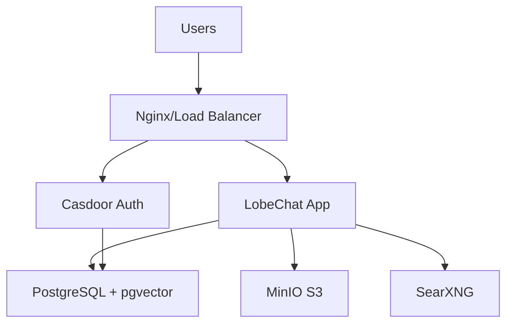

# LobeChat Enterprise Deployment

Production-ready deployment of LobeChat with Casdoor SSO authentication, PostgreSQL database, MinIO storage, and ngrok tunnels.

## 🚀 Quick Start

### Option 1: One-Line Installation (Fastest)

```bash
curl -sL https://raw.githubusercontent.com/struto-development/lobechat-deployment/main/install.sh | sudo bash
```

This single command will:
- **Prompt for port range** (you'll need 8 consecutive ports, e.g., 8000-8007)
- Check prerequisites and port availability
- Create directory structure
- Generate secure passwords
- Deploy all services with proper timing
- Create backups automation
- Provide full deployment summary with assigned ports

### Option 2: Automated Deployment with Claude Code

Simply tell Claude Code:
> **"Deploy LobeChat using instructions at https://raw.githubusercontent.com/struto-development/lobechat-deployment/main/AGENT_DEPLOY.md"**

### Option 3: Manual Deployment

```bash
# Clone this repository
git clone https://github.com/struto-development/lobechat-deployment.git
cd lobechat-deployment

# Run the installation script
sudo ./install.sh

# OR follow the step-by-step instructions in AGENT_DEPLOY.md
```

## ✨ Key Features

- **ngrok Tunnels**: Pre-configured with custom domains (no SSL setup needed)
- **Casdoor SSO**: Organization dropdown and multi-org support
- **PostgreSQL + pgvector**: AI embeddings support
- **MinIO S3**: Object storage for files
- **Automated Backups**: Daily backup with retention
- **One-Command Deploy**: Single URL for Claude Code automation

## 📋 Prerequisites

- Docker Engine 20.10+
- Docker Compose 2.0+
- 4GB RAM minimum
- 20GB disk space
- **8 consecutive available ports** (e.g., 8000-8007 or 3000-3007)
  - Port range will be requested during installation
  - Installer will check for port availability
- (Optional) Domain name for production without ngrok

## 🏗️ Architecture



## 📁 Repository Structure

```
lobechat-deployment/
├── AGENT_DEPLOY.md          # Complete deployment instructions for Claude Code
├── DEPLOY_REFERENCE.md      # Quick reference guide
├── docker-compose.yml       # Main orchestration file
├── .env.example             # Environment template
├── config/
│   ├── casdoor/
│   │   ├── app.conf         # Casdoor configuration
│   │   └── init_data.json   # Initial users/orgs
│   └── nginx/
│       ├── nginx.conf       # Nginx main config
│       └── sites/           # Site configurations
├── scripts/
│   ├── deploy.sh            # Automated deployment
│   ├── backup.sh            # Backup script
│   └── restore.sh           # Restore script
└── README.md                # This file
```

## 🔧 Configuration

### Essential Environment Variables

Edit `.env` file with your configuration:

```bash
# Domain Configuration
DOMAIN_NAME=your-domain.com
APP_URL=https://chat.your-domain.com
AUTH_CASDOOR_ISSUER=https://auth.your-domain.com

# Security Keys (generate with: openssl rand -hex 32)
KEY_VAULTS_SECRET=<64-char-random>
NEXT_AUTH_SECRET=<64-char-random>
CASDOOR_SESSION_SECRET=<32-char-random>

# Database
POSTGRES_PASSWORD=<strong-password>

# Storage
MINIO_ROOT_PASSWORD=<strong-password>

# AI Providers (optional)
OPENAI_API_KEY=sk-...
ANTHROPIC_API_KEY=sk-ant-...
```

### Casdoor SSO Configuration

The system comes pre-configured with:
- **Organization dropdown** at login
- **Multiple organizations** support
- **OAuth2/OIDC** authentication
- **Default users** for testing

Modify `config/casdoor/init_data.json` to customize organizations and users.

## 🚢 Deployment Options

### Option 1: Docker Compose (Recommended)

```bash
# Basic deployment
docker compose up -d

# With nginx reverse proxy
docker compose --profile production up -d

# View logs
docker compose logs -f

# Stop services
docker compose down
```

### Option 2: Kubernetes

See [docs/KUBERNETES.md](docs/KUBERNETES.md) for Helm charts and manifests.

### Option 3: Cloud Platforms

- **AWS**: Use ECS or EKS with provided task definitions
- **Azure**: Deploy to AKS or Container Instances
- **GCP**: Use GKE or Cloud Run
- **DigitalOcean**: Deploy to App Platform or Kubernetes

## 🔐 Security Considerations

### SSL/TLS Setup

1. **Option A: Let's Encrypt (Recommended)**
```bash
# Install certbot
sudo apt-get install certbot

# Generate certificates
sudo certbot certonly --standalone -d chat.your-domain.com -d auth.your-domain.com

# Copy to nginx config
cp /etc/letsencrypt/live/your-domain.com/* config/nginx/ssl/
```

2. **Option B: Commercial Certificate**
- Place certificates in `config/nginx/ssl/`
- Update paths in `config/nginx/sites/lobechat.conf`

### Security Best Practices

- ✅ Change all default passwords immediately
- ✅ Use strong, unique passwords (min 16 characters)
- ✅ Enable firewall rules (only expose 80/443)
- ✅ Regular security updates
- ✅ Enable audit logging
- ✅ Implement backup strategy
- ✅ Use secrets management (Vault, AWS Secrets Manager)

## 📊 Monitoring & Maintenance

### Health Checks

```bash
# Check all services
docker compose ps

# Test endpoints
curl -I https://chat.your-domain.com/health
curl -I https://auth.your-domain.com/api/health
```

### Backup Strategy

```bash
# Backup database
./scripts/backup.sh

# Restore from backup
./scripts/restore.sh backup-2024-10-29.tar.gz
```

### Updates

```bash
# Pull latest images
docker compose pull

# Recreate containers
docker compose up -d --force-recreate
```

## 🔄 Post-Deployment Steps

1. **Access Casdoor Admin Panel**
   - URL: `https://auth.your-domain.com`
   - Organization: `built-in`
   - Username: `admin`
   - Password: `admin123`

2. **Configure Organizations**
   - Create production organizations
   - Set up user roles and permissions
   - Configure OAuth applications

3. **Set Up AI Providers**
   - Add API keys to `.env`
   - Restart LobeChat service
   - Test model availability

4. **Configure Backups**
   - Set up automated daily backups
   - Configure off-site backup storage
   - Test restore procedure

## 🧪 Testing

### Smoke Tests

```bash
# Test authentication flow
curl -L https://chat.your-domain.com/api/auth/signin

# Test Casdoor
curl https://auth.your-domain.com/.well-known/openid-configuration

# Test storage
docker exec lobe-minio mc ls myminio/
```

### Load Testing

```bash
# Install k6
brew install k6

# Run load test
k6 run tests/load-test.js
```

## 🐛 Troubleshooting

### Common Issues

**Services not starting:**
```bash
# Check logs
docker compose logs [service-name]

# Restart specific service
docker compose restart [service-name]
```

**Database connection issues:**
```bash
# Check PostgreSQL
docker exec lobe-postgres pg_isready

# Reset database
docker compose down -v
docker compose up -d
```

**Authentication problems:**
```bash
# Check Casdoor logs
docker logs lobe-casdoor

# Reinitialize Casdoor
docker exec lobe-casdoor rm /initialized
docker compose restart casdoor
```

## 📝 Default Credentials

### Casdoor System Admin
- URL: `https://auth.your-domain.com`
- Organization: `built-in`
- Username: `admin`
- Password: `admin123`

### LobeChat Admin
- URL: `https://chat.your-domain.com`
- Organization: `lobechat`
- Username: `admin`
- Password: Configure in Casdoor

### MinIO Console
- URL: `http://localhost:9001`
- Username: `minioadmin`
- Password: Set in `.env`

## 🤝 Support

- Documentation: [docs/](docs/)
- Repository: [GitHub](https://github.com/struto-development/lobechat-deployment)
- Issues: [GitHub Issues](https://github.com/struto-development/lobechat-deployment/issues)
- Discord: [Join Community](https://discord.gg/lobechat)

## 📜 License

This deployment configuration is provided under MIT License.
LobeChat is licensed under its own terms.